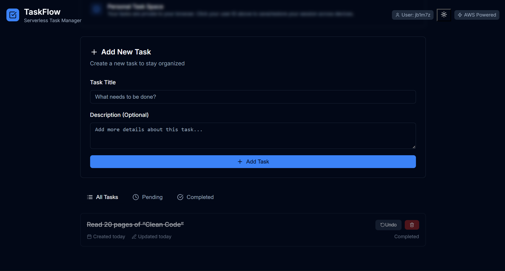

# TaskFlow

A production-ready serverless todo application demonstrating modern AWS architecture patterns and best practices.



## Live Demo

**Production URL**: https://d32etk8487ebhy.cloudfront.net

Built with AWS serverless services, featuring real-time synchronization, user session management, and global CDN distribution.


## Key Features

- **Serverless Architecture**: 100% serverless using AWS Lambda, API Gateway, and DynamoDB
- **Global Distribution**: CloudFront CDN with SSL/TLS termination
- **User Isolation**: Client-side session management with UUID-based user identification
- **CORS Compliant**: Proper cross-origin resource sharing implementation
- **Responsive UI**: Modern interface with dark/light theme support
- **Cost Optimized**: Designed to run within AWS Free Tier limits

## Architecture

### Infrastructure Overview


### Service Integration


```
┌─────────────────┐    HTTPS     ┌──────────────────┐    ┌──────────────────┐
│   Web Browser   │ ──────────► │   CloudFront     │────│   Amazon S3      │
│   (TaskFlow UI) │              │   (Global CDN)   │    │  (Static Website │
│ + localStorage  │              │   + SSL/TLS      │    │    Hosting)      │
│   (User ID)     │              │                  │    │                  │
└─────────────────┘              └──────────────────┘    └──────────────────┘
         │                                │
         │ REST API Calls + User ID       │
         │ (HTTPS)                        │
         ▼                                │
┌─────────────────┐              ┌──────────────────┐
│  Amazon API     │              │   AWS IAM        │
│   Gateway       │◄─────────────┤   (Roles &       │
│  (REST API)     │   Security   │   Permissions)   │
│ /todos?userId=  │              │                  │
└─────────────────┘              └──────────────────┘
         │
         │ Invoke Functions
         │ (with User ID)
         ▼
┌─────────────────┐              ┌──────────────────┐
│   AWS Lambda    │              │  Amazon          │
│   Functions     │◄─────────────┤  CloudWatch      │
│ • Create Todo   │   Logging    │  (Logs &         │
│ • Get Todos     │              │   Monitoring)    │
│ • Update Todo   │              │                  │
│ • Delete Todo   │              │                  │
│ • Get Todo      │              │                  │
└─────────────────┘              └──────────────────┘
         │
         │ Read/Write Data
         │ (Filtered by User ID)
         ▼
┌─────────────────┐
│  Amazon         │
│  DynamoDB       │
│ ┌─────────────┐ │
│ │ TodoItems   │ │
│ │ + userId    │ │
│ │ + GSI Index │ │
│ └─────────────┘ │
└─────────────────┘
```

**Technology Stack:**
- **CDN/SSL**: CloudFront with custom SSL certificate
- **Static Hosting**: S3 with website configuration
- **API Layer**: API Gateway REST API with CORS
- **Compute**: Lambda functions (Python 3.9 runtime)
- **Database**: DynamoDB with on-demand billing
- **Security**: IAM roles with least-privilege policies
- **Observability**: CloudWatch Logs and X-Ray tracing

## Prerequisites

- AWS Account with programmatic access
- IAM permissions for Lambda, API Gateway, DynamoDB, S3, CloudFront
- AWS CLI configured (for CloudFormation deployment)

## Deployment

### Infrastructure as Code (Recommended)

```bash
# Deploy using CloudFormation
aws cloudformation deploy \
  --template-file cloudformation/template.yaml \
  --stack-name taskflow-serverless \
  --capabilities CAPABILITY_IAM \
  --region us-east-1
```

### Manual Deployment

Follow the [AWS Console Deployment Guide](docs/aws-console-deployment-guide.md) for step-by-step instructions.

## Project Structure

```
├── README.md
├── LICENSE
├── .gitignore
├── TaskFlow Architecture Diagram.png
├── home.png
├── frontend/
│   ├── index.html              # SPA entry point
│   ├── script.js               # Application logic
│   ├── style.css               # Responsive styling
│   └── favicon.svg
├── lambda/                     # Serverless functions
│   ├── create-todo.py          # POST /todos
│   ├── get-todos.py            # GET /todos
│   ├── get-todo.py             # GET /todos/{id}
│   ├── update-todo.py          # PUT /todos/{id}
│   └── delete-todo.py          # DELETE /todos/{id}
├── cloudformation/
│   └── template.yaml           # Complete infrastructure stack
├── deployment/
│   ├── lambda-functions.zip    # Packaged deployment artifact
│   └── simple-template.yaml    # Minimal CloudFormation template
└── docs/                       # Deployment documentation
    ├── aws-console-deployment-guide.md
    ├── deployment-guide.md
    ├── deployment-checklist.md
    └── free-tier-guide.md
```

## API Reference

| Method | Endpoint | Description | Parameters |
|--------|----------|-------------|------------|
| `GET` | `/todos` | List user todos | `?userId=<uuid>` |
| `POST` | `/todos` | Create todo | `{title, description, userId}` |
| `GET` | `/todos/{id}` | Get todo by ID | Path: `id` |
| `PUT` | `/todos/{id}` | Update todo | `{title, description, completed}` |
| `DELETE` | `/todos/{id}` | Delete todo | Path: `id` |

All endpoints return JSON and include proper CORS headers.

## Configuration

### Environment Variables

Lambda functions use the following environment variables:
- `TABLE_NAME`: DynamoDB table name (set by CloudFormation)

### Frontend Configuration

Update the API endpoint in `frontend/script.js`:
```javascript
const API_BASE_URL = 'https://your-api-id.execute-api.region.amazonaws.com/prod';
```

### Custom Domain (Optional)

To use a custom domain:
1. Request SSL certificate in ACM (us-east-1 for CloudFront)
2. Update CloudFront distribution with custom domain
3. Configure Route 53 DNS records

## Security

- **Transport Security**: HTTPS enforced via CloudFront
- **Access Control**: IAM roles with least-privilege policies
- **CORS Policy**: Configured for cross-origin requests
- **Input Validation**: Server-side validation in all Lambda functions
- **Error Handling**: Sanitized error responses without sensitive data

## Cost Analysis

| Service | Free Tier | Estimated Monthly Cost |
|---------|-----------|----------------------|
| Lambda | 1M requests | $0.00 |
| API Gateway | 1M requests | $0.00 |
| DynamoDB | 25GB storage | $0.00 |
| S3 | 5GB storage | $0.00 |
| CloudFront | 50GB transfer | $0.00 |
| **Total** | | **$0.00** |

*Costs remain $0 within AWS Free Tier limits. Post free-tier costs scale with usage.*

## Troubleshooting

### Common Issues

**CORS Errors**
- Ensure CORS is enabled for all methods in API Gateway
- Redeploy API after CORS configuration changes

**502 Bad Gateway**
- Check Lambda function logs in CloudWatch
- Verify environment variables are set correctly
- Ensure IAM role has DynamoDB permissions

**DynamoDB Access Denied**
- Verify Lambda execution role has proper DynamoDB policies
- Check table name matches environment variable

### Monitoring

View logs and metrics:
```bash
# Lambda logs
aws logs describe-log-groups --log-group-name-prefix "/aws/lambda/"

# API Gateway logs (if enabled)
aws logs describe-log-groups --log-group-name-prefix "API-Gateway-Execution-Logs"
```

## Documentation

- [AWS Console Deployment](docs/aws-console-deployment-guide.md) - Manual deployment guide
- [CloudFormation Deployment](docs/deployment-guide.md) - Infrastructure as Code
- [Free Tier Guide](docs/free-tier-guide.md) - Cost optimization strategies
- [Deployment Checklist](docs/deployment-checklist.md) - Verification steps

## Technical Highlights

This project demonstrates:
- **Serverless Architecture Patterns**: Event-driven, stateless compute
- **Infrastructure as Code**: CloudFormation templates with proper resource dependencies
- **REST API Design**: RESTful endpoints with proper HTTP methods and status codes
- **Client-Side State Management**: UUID-based user sessions with localStorage
- **CDN Integration**: CloudFront distribution with S3 origin
- **Security Best Practices**: IAM least-privilege, HTTPS enforcement, input validation

## Contributing

1. Fork the repository
2. Create a feature branch (`git checkout -b feature/enhancement`)
3. Commit changes (`git commit -am 'Add enhancement'`)
4. Push to branch (`git push origin feature/enhancement`)
5. Create Pull Request

## License

MIT License - see [LICENSE](LICENSE) file for details.

---

**Built with AWS serverless services for production workloads.**